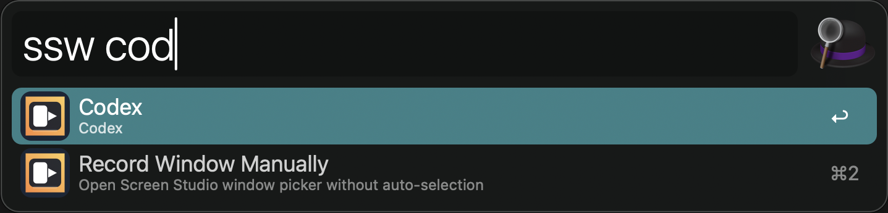
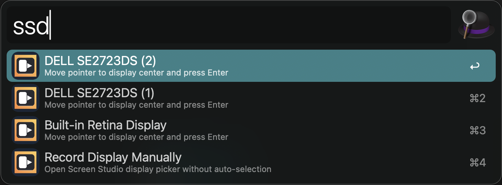

# Screen Studio Alfred Workflow

Control Screen Studio from Alfred with quick actions, a command browser, and smart window or display targeting.

## Setup

1. Download the latest `Screen Studio.alfredworkflow` asset from GitHub Releases.
2. Open the file to import it into Alfred.
3. Make sure Screen Studio is installed.
4. Give Alfred Accessibility permission in macOS System Settings.
5. If targeting windows or displays does not work on your Mac, also grant Accessibility permission to Alfred's shell host.

## Usage

Browse all supported Screen Studio actions via the `ss` keyword.

Start window recording via the `ssw` keyword. The first result opens Screen Studio's picker manually, and the remaining results target windows by app name and window title.

Start display recording via the `ssd` keyword. The first result opens Screen Studio's picker manually, and the remaining results target displays by display name.

Start area recording via the `ssa` keyword.

Finish the current recording via the `ssf` keyword.

Cancel the current recording via the `ssc` keyword.

Restart the current recording via the `ssr` keyword.

Open Screen Studio settings via the `sss` keyword.

Open the Screen Studio projects folder via the `ssp` keyword.

Toggle the recording controls via the `sstc` keyword.

Toggle the recording area cover via the `ssta` keyword.

Copy and zip the current project via the `ssz` keyword.

## Notes

`record-window` and `record-display` still need a final confirmation inside Screen Studio. This workflow automates that step by moving the pointer to the target center and pressing `Enter`.

File naming and export remain manual in Screen Studio after recording finishes.

## Troubleshooting

If window or display targeting behaves unexpectedly on another Mac, check the workflow log:

- in Alfred: `$alfred_workflow_data/screenstudio.log`
- outside Alfred: `.screenstudio-logs/screenstudio.log`
